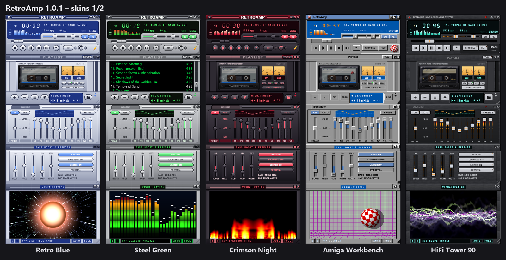
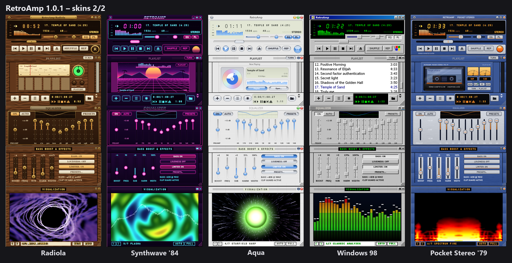

# RetroAmp

A native Windows (C++/Win32) audio player in the style of classic Winamp 2.x.




## Build

```
build.bat
```
Output: `build\Release\RetroAmp.exe`, with bundled skins in `build\Release\Skins\`.
The CRT is linked statically, so the exe runs without any redistributables.

### Installer

```
build_installer.bat
```
Builds the player and an Inno Setup 6 installer: `installer\Output\RetroAmp_Setup_<version>.exe`
(Polish/English, all users or current user only, Start menu and optional desktop shortcut,
"Open with" for audio files and playlists, `.wsz` skins open in RetroAmp, "Play in RetroAmp" on folders).

## Features

- **Skins:** classic Winamp 2.x format (`.wsz` / `.zip` / folder of BMPs). Each skin redraws the whole interface.
  You can drag a `.wsz` onto the player or use *Options menu → Skins → Load skin*. Thousands of skins are at https://skins.webamp.org.
  Built-in (HD, sharp at every zoom): Retro Blue (default), Steel Green, Crimson Night, **Amiga Workbench**
  (Workbench 3.0 / MagicWB style with the Boing Ball), and animated skins with their own panel:
  **HiFi Tower 90** (cassette deck with spinning reels, VU needles and the title on the tape label),
  **Radiola** (valve radio: Nixie digits, magic eye, dial pointer following the song),
  **Synthwave '84** (moving neon grid, sunset), **Aqua** (spinning CD), **Windows 98** (Sound Recorder)
  and **Pocket Stereo '79** (late-70s portable cassette player: blue brushed metal, silver keys, orange HOTLINE button).
  The panel and the playlist share a slot (toggle button, **PL** button, or the cassette gadget on the playlist).
  Generators: `tools/gen_skin.py`, `tools/gen_amiga.py`, `tools/gen_kit.py`. Make your own: see [SKINNING.md](SKINNING.md).
  HD skins use the same sprite layout, just N× larger PNG sheets; classic 1× skins are smoothed with Scale2x/Scale3x.
- **Formats:** Media Foundation (MP3, WAV, FLAC, AAC/M4A, WMA, ALAC, AC3, MP2) and ffmpeg for everything else
  (OGG, Opus, APE, WavPack, AIFF, TTA, MKA, DSF, MOD/XM/S3M/IT, NSF/SPC/VGM...). ffmpeg is looked up next to
  the exe, then in PATH, then in `C:\ffmpeg\bin`.
- **Equalizer:** 10 bands plus preamp, Winamp or ISO frequencies, 21 built-in presets, your own presets,
  import/export of Winamp `.eqf` files, and AUTO mode (remembers the EQ per track).
- **Bass Boost & Effects** (Alt+B, docks under the EQ): low-shelf bass boost with adjustable frequency, sub-bass,
  psycho-acoustic harmonics (bass on small speakers), stereo width, loudness, and a limiter that prevents clipping.
- **Visualization** (Alt+V or the V button in the main window): 7 old-school presets in the MilkDrop/AVS spirit
  (Classic Analyzer, Scope Trails, Milk Tunnel, Starfield Warp, Plasma, Spectrum Fire, Alemiga — Boing Ball with ProTracker VU meters), with beat detection,
  AUTO mode (switches every 25 s), and fullscreen (double-click or F; Esc to exit). Switch presets with ←/→ or the mouse wheel.
- **Zoom:** 100 / 150 / 200 / 250 / 300 / 400 % (*Options → Size*, Ctrl+D, Ctrl + / Ctrl −).
  Fractional sizes are rendered at double resolution and averaged 2×2, so pixels stay even.
- **Output:** WASAPI, which follows the Windows default output device and switches on the fly
  (for example when Bluetooth headphones connect).
- **Other:** windows dock and snap to each other, window shade mode, spectrum/oscilloscope visualization,
  M3U/M3U8/PLS playlists, Jump to file (J), media keys, taskbar buttons and progress, single instance.

## Keyboard

Z prev · X play · C pause · V stop · B next · L open · J jump · S shuffle · R repeat · ←/→ seek · ↑/↓ volume
Alt+G EQ · Alt+E playlist · Alt+V visualization · Alt+B bass · Alt+S skin · Ctrl+T time remaining · Ctrl+W shade · Ctrl+A always on top

## Tests

`build\Release\retroamp_selftest.exe <folder with audio files> [skin.wsz...]` checks decoding, seeking,
the EQ/bass frequency response, the limiter and skin loading.

## License

RetroAmp is released under the **PolyForm Noncommercial License 1.0.0**: free to use, modify and share
for any non-commercial purpose; **selling it or using it commercially is not allowed**.
Full text: [LICENSE](LICENSE) (English, binding) · [LICENSE.pl.md](LICENSE.pl.md) (Polish translation).

Licencja: **PolyForm Noncommercial 1.0.0**. Program można za darmo używać, zmieniać i udostępniać
w celach niekomercyjnych, ale **nie wolno go sprzedawać ani wykorzystywać komercyjnie**.
